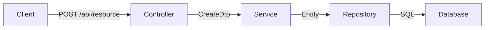
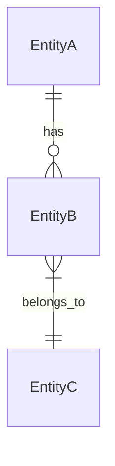
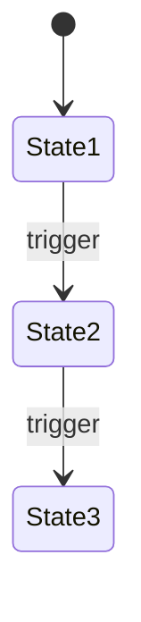
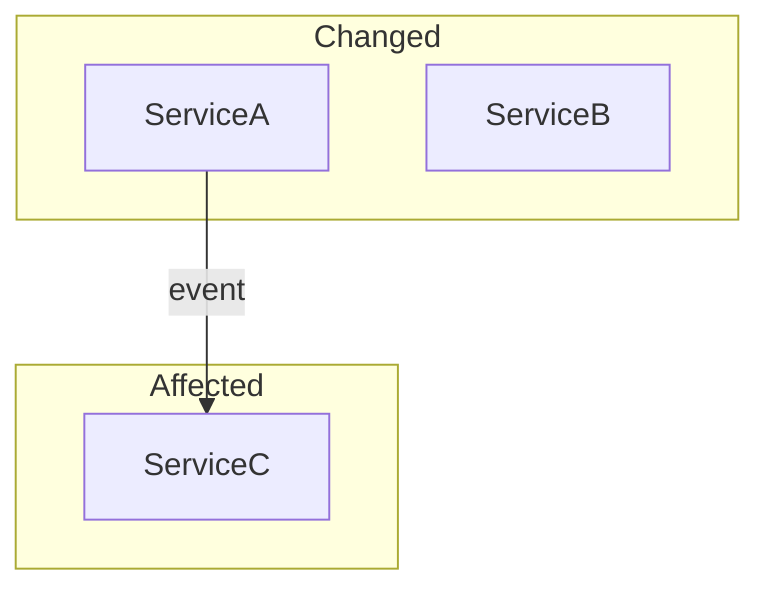

## When to Use

After finishing a first draft of your changes — before pushing or creating a PR. This is NOT a gate. It's a colleague looking at your diff saying "hey, noticed a few things."

When triggered (by user saying "run code insights", "check my changes", or `/code-insights`), ask:

> I can check your changed files for quick improvements. What would you like?
>
> 1. **Quick nudges** — small refactoring suggestions on your diff (2 min)
> 2. **DTO & architecture insights** — deeper analysis with diagrams for your PR description (5 min)
> 3. **Both**

## Mode 1: Quick Nudges

### Step 1: Get the changed files

```bash
git diff --name-only HEAD~$(git log --oneline main..HEAD | wc -l | tr -d ' ') 2>/dev/null || git diff --name-only main...HEAD
```

Separate into frontend (.ts, .tsx, .css) and backend (.cs) files.

### Step 2: Load the right checks per file type

**For .tsx/.ts files**, check these patterns:

| Pattern | What to look for | Why it matters |
|---------|-----------------|----------------|
| Computation in render | `.sort()`, `.filter()`, `.map()` chains directly in JSX return | Re-runs every render. Wrap in `useMemo` if list > ~10 items |
| Inline objects in props | `style={{...}}` or `config={{...}}` as JSX props | Creates new reference every render → breaks `React.memo` |
| useEffect for derived state | `useEffect(() => setState(computed), [deps])` | Extra render cycle. Just compute: `const x = derive(deps)` |
| Sequential awaits | `await a(); await b();` where a and b are independent | Double the wait time. Use `Promise.all([a(), b()])` |
| Missing error boundary | New route/page component without error handling | One crash takes down the whole page |
| Complex ternary in JSX | Nested `? :` chains in return | Extract to a function for readability |
| Barrel imports | `import { X } from './index'` or `from '@/ui'` | Pulls in entire module. Direct import is tree-shakeable |
| String concat for classes | Template literals building className | Use `clsx()` or CVA for variant-based styling |
| Large component (> 150 lines) | Single component file that keeps growing | Could any block become its own component or hook? |
| Hardcoded magic numbers | `if (items.length > 50)` without explanation | Extract to named constant: `const MAX_VISIBLE = 50` |

**For .cs files**, check these patterns:

| Pattern | What to look for | Why it matters |
|---------|-----------------|----------------|
| Missing AsNoTracking | Read-only queries without `.AsNoTracking()` | ~30% slower. EF tracks entities needlessly |
| N+1 queries | Loop with await inside, or lazy loading | Use `.Include()` or batch the query |
| Sequential awaits | `await a; await b;` when independent | Use `Task.WhenAll` for parallel execution |
| Catch-all exception | `catch (Exception)` with swallow or return null | Catch specific types, log, rethrow or handle properly |
| Large method (> 30 lines) | Method doing too many things | Split into well-named private methods |
| Missing validation | Public API endpoint without input validation | Add FluentValidation or manual checks |
| String concatenation in loop | `result += item` in a foreach | Use `StringBuilder` — O(n) vs O(n²) |
| New HttpClient per request | `new HttpClient()` inside a method | Socket exhaustion. Use `IHttpClientFactory` |
| Blocking async | `.Result` or `.Wait()` on async calls | Thread pool starvation. Use `await` |
| Missing cancellation token | Async methods without `CancellationToken` parameter | Can't cancel long operations gracefully |

### Step 3: Present nudges

Show max 5-7 nudges, highest impact first. For each:

```
📌 [filename]:[line] — [pattern name]

   Now:     [what the code does currently, 1 line]
   Better:  [what it could look like, 1 line]

   ✅ Why:    [one sentence — the concrete benefit]
   ⏭️ Skip if: [when it's fine to leave as-is]
```

End with:
> These are suggestions, not requirements. Want me to apply any of them?

If the user says yes, apply the selected ones. If no, move on — no judgment.

### Step 4: Check with performance skills

After pattern checks, cross-reference with the performance skills if loaded:

**If `frontend-performance` is loaded:**
- Check for missing lazy loading on new route components
- Check for images without width/height
- Check bundle impact of new dependencies (any new `import` from `node_modules`)

**If `backend-performance` is loaded:**
- Check for missing pagination on list endpoints
- Check for unbounded `.ToListAsync()` without `.Take()`
- Check for missing response compression on new endpoints

Only mention performance findings if they're relevant to the changed files. Don't scan the whole codebase.

---

## Mode 2: DTO & Architecture Insights (for PR description)

Deeper analysis that produces content ready to paste into a PR body.

### Step 1: Analyze the full changeset

```bash
git diff main...HEAD --stat
git diff main...HEAD --name-only
```

### Step 2: Identify architectural changes

Look for:
- **New or modified DTOs/models** — any class ending in `Dto`, `Request`, `Response`, `ViewModel`, or in a `Models/` directory
- **New or modified entities** — classes with `[Table]` attribute or in `Entities/` directory
- **API endpoint changes** — new/modified controller actions
- **Database migrations** — new files in `Migrations/`
- **Cross-service calls** — new HTTP client usage or message bus publishes

### Step 3: For each DTO/entity change, present a question

```
❓ [ClassName] — [what changed]

   Current shape:
   [2-3 key properties]

   Proposed change:
   [what's being added/removed/modified]

   Pros:
   + [concrete benefit]
   + [concrete benefit]

   Cons:
   - [concrete risk or trade-off]

   Alternative approach:
   → [different way to solve this, if one exists]
```

### Step 4: Generate mermaid diagrams

**Data flow** (if API endpoints changed):


**Entity relationships** (if models/entities changed):


**State diagram** (if status/workflow logic changed):


**Cross-service impact** (if multiple services touched):


Only generate diagrams that are relevant to the actual changes. Don't force diagrams where they don't add clarity.

### Step 5: Surface questions for reviewers

Look for non-obvious decisions that reviewers should weigh in on:

```
🤔 Questions for reviewers:

1. [Question about a design choice]
   Context: [why this matters]

2. [Question about a trade-off]
   Context: [what's at stake]
```

### Step 6: Output for PR description

Present the complete output as a copyable block:

```markdown
## Architecture Insights

### Data Flow
[mermaid diagram if relevant]

### Changes
| File | What changed | Impact |
|------|-------------|--------|
| [file] | [change] | [breaking/non-breaking/new] |

### DTO Analysis
[questions with pros/cons]

### Entity Diagram
[mermaid diagram if relevant]

### Questions for Reviewers
[numbered questions with context]
```

Say: "Here's the architecture insights section — want me to paste it into the PR description, or would you like to adjust anything first?"

---

## Recommended External Skills to Combine

These plugins provide deeper static analysis that complements the pattern-based checks above:

```bash
# Official Claude Code review — 4 parallel agents, confidence scoring, diff-only
# Already built-in: /code-review

# React/TypeScript anti-patterns — dedicated guides for React 19, TS, perf, security
git clone https://github.com/awesome-skills/code-review-skill ~/.claude/skills/code-review-skill

# .NET anti-patterns — slopwatch catches LLM-generated anti-patterns specifically
/plugin marketplace add Aaronontheweb/dotnet-skills

# Security review on changed files — from Trail of Bits (top security firm)
/plugin marketplace add trailofbits/skills

# Real-time enforcement hooks — catches issues as you write, not after
npm install -g claudekit && claudekit setup

# Periodic full codebase audit (monthly, not per-PR) — 31 parallel auditors
/plugin add levnikolaevich/claude-code-skills --plugin codebase-audit-suite
```
