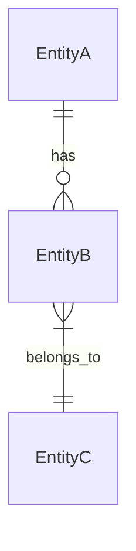
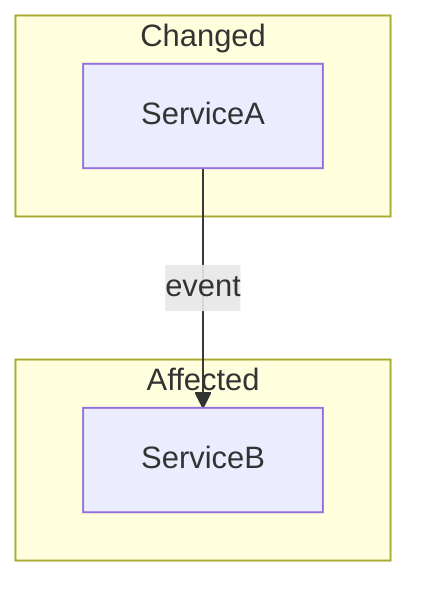

## When to Use

After finishing a first draft. Not a gate — a colleague looking at your diff.

Trigger: user says "check my changes", "run code insights", `/code-insights`, or answers yes to "Want to run a quick refactoring check?"

Ask:
> I can check your changed files. What would you like?
> 1. **Quick nudges** — small improvements on your diff (2 min)
> 2. **Deep insights** — DTO analysis + mermaid diagrams for PR description (5 min)
> 3. **Both**

---

## Mode 1: Quick Nudges

### Step 1: Get changed files

```bash
git diff --name-only main...HEAD 2>/dev/null || git diff --name-only HEAD~1
```

Split into frontend (.ts/.tsx) and backend (.cs) files.

### Step 2: Check patterns per file type

**Frontend (.tsx/.ts) — React 19 aware**

NOTE: **React Compiler is NOT enabled in this repo.** There is no `babel-plugin-react-compiler` in `apps/web/vite.config.*` or `package.json`, and `docs/CODING_STYLE_FRONTEND.md:230` reads "React Compiler (when re-enabled) will handle memoization automatically. Until then, `useMemo` is fine for expensive computations." It was trialled and backed out.

So memoization is **manual and load-bearing**: `useMemo` / `useCallback` / `React.memo` are legitimate suggestions, and *removing* them is a regression, not a cleanup. Do not tell anyone the compiler will cover it.

Two things worth flagging in review:
- **Unstable identity feeding a hook dependency** — `foo?.data ?? []` or an inline object/array passed as a dep, or into a `useMemo`/`useEffect` dep array. A fresh identity every render defeats the memo and can loop an effect. This is the common real bug, not a micro-optimisation.
- **Genuinely expensive work recomputed every render** — sorts, filters and reduces over non-trivial lists in the render body.

Don't flag memoizing a trivial derived value (`const fullName = first + " " + last`); the styleguide calls that out too.

Also focus on:

| Pattern | Look for | Why it matters |
|---------|----------|----------------|
| Async waterfall | Sequential `await a(); await b();` where independent | Double wait time. Use `Promise.all` |
| Computation in JSX | `.sort()/.filter()/.reduce()` chains in the return statement | Readability issue. Extract to a named const above the return |
| Inline function in JSX loop | `{items.map(i => <Item onClick={() => handle(i)} />)}` | Readability first — extract if complex. With no compiler, it also re-creates the handler each render, which matters only if the child is memoized or the list is large |
| Missing error boundary | New page/route component without error handling | One crash takes down the whole page |
| Barrel imports | `import { X } from './index'` or `from '@/ui'` | Pulls in entire module. Direct import is tree-shakeable |
| Large component (> 150 lines) | Single file keeps growing | Split into smaller components or custom hooks |
| Hardcoded magic values | `if (items.length > 50)` | Extract to named constant |
| Missing key or index key | `key={index}` on dynamic lists | Causes bugs on reorder/delete. Use stable ID |
| New dependency imported | New `import` from `node_modules` | Check bundle impact — is it tree-shakeable? How big? |

**Backend (.cs) — .NET patterns**

| Pattern | Look for | Why it matters |
|---------|----------|----------------|
| Sequential awaits | `await a; await b;` when independent | Use `Task.WhenAll` for parallel |
| Missing AsNoTracking | Read queries without `.AsNoTracking()` | ~30% slower for reads |
| N+1 query | Loop with await inside, or lazy loading in API | Use `.Include()` or batch |
| Unbounded query | `.ToListAsync()` without `.Take()` or pagination | Can return millions of rows |
| Large method (> 30 lines) | Method doing too many things | Split into well-named privates |
| Catch-all exception | `catch (Exception) { return null; }` | Catch specific, log, handle |
| String concat in loop | `result += item` in foreach | Use `StringBuilder` |
| New HttpClient | `new HttpClient()` in method | Socket exhaustion. Use `IHttpClientFactory` |
| Blocking async | `.Result` or `.Wait()` | Thread pool starvation |
| Missing CancellationToken | Async method without token param | Can't cancel long operations |
| Entity in API response | Returning EF entity directly from controller | Leaks DB schema. Use DTO |
| Missing validation | Public endpoint without input validation | Add FluentValidation |

### Step 3: Cross-check with performance

If the changed files include:
- **New route/page** → check lazy loading (`React.lazy`), check bundle impact
- **New API endpoint** → check response compression, pagination, caching headers
- **New database query** → check index exists, check query plan
- **New npm dependency** → note the package size

### Step 4: Present nudges

Max 5-7, highest impact first:

```
📌 UserList.tsx:42 — Async waterfall

   Now:     const user = await getUser(id); const posts = await getPosts(id);
   Better:  const [user, posts] = await Promise.all([getUser(id), getPosts(id)])

   ✅ Why:    Halves the wait time — these are independent requests
   ⏭️ Skip if: Second call depends on first result
```

End with:
> These are suggestions, not requirements. Want me to apply any of them?

---

## Mode 2: Deep Insights (for PR description)

### Step 1: Analyze full changeset

```bash
git diff main...HEAD --stat
git diff main...HEAD --name-only
```

### Step 2: Identify DTO/entity changes

Look for:
- Classes ending in `Dto`, `Request`, `Response`, `ViewModel`
- Classes in `Models/`, `Entities/` directories
- Classes with `[Table]` attribute
- New/modified controller actions (API contract changes)
- New migration files

### Step 3: For each DTO change

```
❓ [ClassName] — [what changed]

   Current: [key properties]
   Proposed: [what's added/removed/changed]

   Pros:
   + [concrete benefit]
   + [concrete benefit]

   Cons:
   - [concrete risk]

   Alternative:
   → [different approach if one exists]
```

### Step 4: Generate mermaid diagrams

Only if relevant to actual changes:

**Data flow** (API endpoint changes):


**Entity relationships** (model changes):


**Cross-service impact** (multiple services touched):


### Step 5: Questions for reviewers

```
🤔 Questions for reviewers:

1. [Design choice question]
   Context: [why it matters]

2. [Trade-off question]
   Context: [what's at stake]
```

### Step 6: Output for PR

Copyable block:

```markdown
## Architecture Insights

### Data Flow
[mermaid diagram if relevant]

### Changes
| File | What changed | Impact |
|------|-------------|--------|
| [file] | [change] | [breaking/non-breaking/new] |

### DTO Analysis
[questions with pros/cons]

### Questions for Reviewers
[numbered list]
```

> Here's the architecture insights section. Want me to paste it into the PR description?

---

## Recommended External Plugins

```bash
# React 19 + TypeScript + perf + security review guides
# Already installed at ~/.claude/skills/code-review-skill

# Trail of Bits — security analysis scoped to your changed files
# Already installed at ~/.claude/skills/trailofbits-differential-review

# Official Claude Code review — 4 parallel agents, diff-only
# Built-in: /code-review
```
